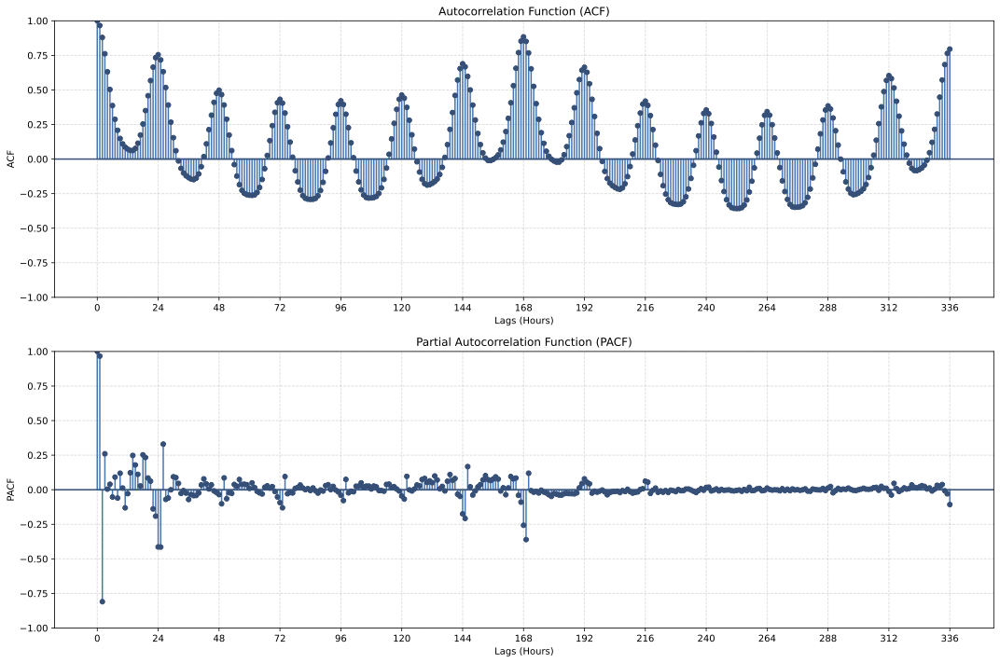
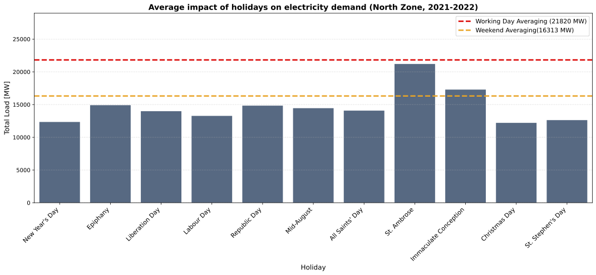
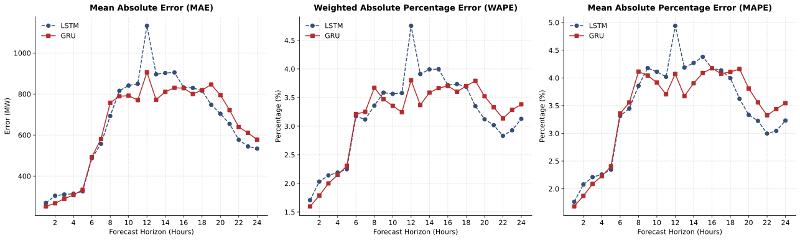
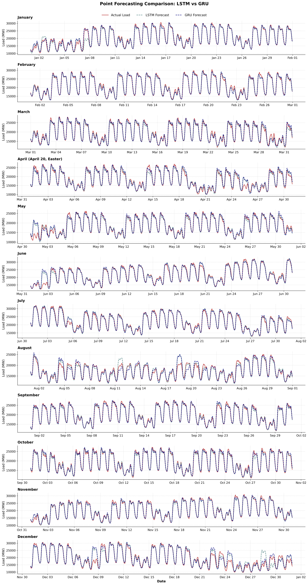
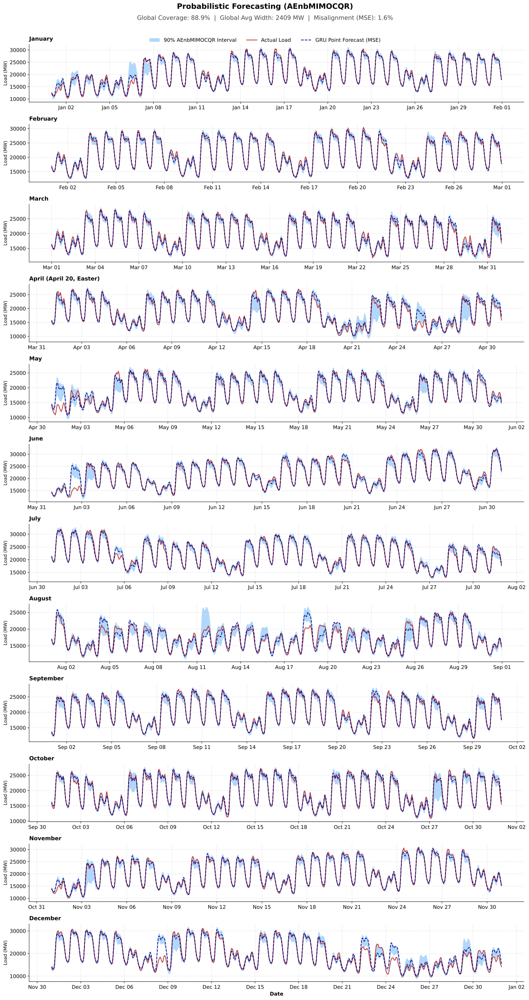

# Machine Learning and Deep Learning for Time Series Forecasting with Uncertainty Quantification

**Day-ahead electricity demand forecasting for Northern Italy**, comparing Machine Learning and Deep Learning models, with prediction intervals via Conformal Prediction (AEnbMIMOCQR).

> Master's thesis — Statistics and Economics, University of Milano-Bicocca.

---

## Overview

Accurate electricity demand forecasts are essential for **power system scheduling** (in Italian, dispacciamento): generation must be planned to match consumption in real time, since electricity is hard to store. **Overestimating** demand commits power plants unnecessarily and drives up operating costs; **underestimating** it forces real-time corrective actions and, in the worst case, can lead to blackouts.

This project forecasts the demand of the **Northern Italy** market area for the next **24 hours** (a MIMO multistep strategy with horizon `h = 24`), producing both **point** and **interval** estimates.

The work is organised in three parts:
1. Descriptive analysis of the time series
2. Point forecasting — model comparison and selection
3. Uncertainty quantification via Conformal Prediction

---

## Dataset

Source: [Terna](https://www.terna.it/) (Italian transmission system operator).

| | |
|---|---|
| **Area** | Northern Italy (Valle d'Aosta, Piedmont, Liguria, Lombardy, Emilia-Romagna, Veneto, Trentino-Alto Adige, Friuli-Venezia Giulia) |
| **Period** | 1 Jan 2021 → 31 Dec 2025 |
| **Frequency** | 15 min, aggregated to hourly (arithmetic mean) |
| **Observations** | 43,824 hourly records |
| **Target** | Total load, in MW |

**Missing values** occur at the spring clock change (02:00 does not exist on the switch day) and are imputed by linear interpolation; the autumn duplication of 02:00 is absorbed by the hourly mean aggregation. No outliers are present.

---

## 1. Descriptive analysis

The series shows **stable variance** and **no deterministic trend**, but is **non-stationary in mean** because of multiple seasonalities:


- **Annual** — lower consumption in holiday/vacation months (December, August); high summer demand (air conditioning); winter above spring/autumn (heating, lighting).
- **Weekly** — higher on weekdays, dropping over the weekend, lowest on Sunday.
- **Daily** — peaks during daytime working hours, declines at night.

![[Left] Annual seasonality, [Middle] Weekly seasonality, [Right] Daily seasonality.](figures/APP_2.png)

The **ACF** peaks every 24 h (daily) and every 168 h (weekly); the **PACF** shows strong dependence on the previous 24 hours and on lag 168.



**Stationarity tests** (on the seasonally differenced series, lags 24 and 168): the **ADF** test rejects the unit root at all significance levels, and the **KPSS** test does not reject stationarity — the two agree that the differenced series is stationary.

**Holidays** reduce demand below the working-day average; St. Ambrose (a Milan-only holiday) has no visible effect on the region, and the Immaculate Conception aligns with weekend levels.



---

## 2. Point forecasting

### Feature engineering

Two data representations are built:

**Tabular matrix** (for KNN, tree-based models, MLP):
- Current load + lags 1–24 h + lag 168 h (one week)
- Seasonal counters: hour (0–23), day of week (1–7), month (1–12)
- Calendar dummies: fixed holidays + a separate Easter dummy
- Final shape: **43,632 × 55** (31 features + 24 targets)

**3D tensor** (for RNN, LSTM, GRU, TCN):
- 6 features per timestep (load + 3 seasonal + 2 calendar dummies)
- 169 timesteps per instance (current hour `t` + 168 preceding hours)
- Shape: **(43,632, 169, 6)**

> Temperature was deliberately excluded: the future temperature is itself unknown at forecast time (using its forecast would inject extra error), and a single measurement cannot summarise such a climatically heterogeneous macro-area. *Gradient boosting* was excluded as it does not natively handle multi-output targets.

### Experimental setup

- **Split** (temporal hold-out): sub-training 2021–2023 · validation 2024 · test 2025
- **Scaling**: min-max, fitted only on training data (no leakage); trees need no scaling
- **Search**: random search (ML) / grid search (DL); best configuration reported
- **Loss**: MSE (targets the conditional mean)
- **Metrics**: MAE (primary), WAPE, MAPE — computed per horizon, then averaged
- **Evaluation**: non-overlapping 24 h blocks (one forecast per day)

### Results (validation set)

| Model | MAE (MW) | WAPE (%) | MAPE (%) |
|---|---:|---:|---:|
| K-Nearest Neighbours | 733.45 | 3.69 | 3.94 |
| Decision Tree | 870.75 | 4.38 | 4.63 |
| Bagging | 705.93 | 3.55 | 3.75 |
| Random Forest | 711.47 | 3.58 | 3.79 |
| Multilayer Perceptron | 950.03 | 4.78 | 5.06 |
| RNN | 703.31 | 3.54 | 3.76 |
| **LSTM** | **670.56** | **3.38** | **3.50** |
| GRU | 673.59 | 3.39 | 3.56 |
| TCN | 716.94 | 3.61 | 3.80 |

**Key observations:**
- Across all DL models, a **single wide hidden layer** (128–256 neurons) beats deeper architectures — the task has no complex hierarchy to exploit and the data are limited.
- The MLP lags behind because it cannot handle temporal structure directly; the gated architectures (LSTM/GRU) beat the plain RNN by preserving information over longer sequences.

### Best models: LSTM vs GRU

| Model | Layers | Neurons | Parameters | Dropout | LR | Optimizer |
|---|:-:|:-:|:-:|:-:|:-:|:-:|
| LSTM | 1 | 256 | 275,480 | 0.1 | 0.001 | Adam |
| GRU | 1 | 256 | 208,920 | 0.2 | 0.001 | Adam |

Both show no overfitting (validation loss tracks training loss, stopped early at the minimum). The **GRU** achieves comparable accuracy with **~24% fewer parameters**, making it the preferred final model for parsimony.

### Test set (2025)

| Model | MAE (MW) | WAPE (%) | MAPE (%) |
|---|---:|---:|---:|
| LSTM | 660.21 | 3.31 | 3.46 |
| **GRU** | **649.69** | **3.25** | **3.45** |



Test performance is consistent with validation (no overfitting). The error **grows with the forecast horizon**, peaking around midday and easing towards midnight. The models capture ordinary days well but struggle on holidays and adjacent days, tending to **overestimate** demand; the gap shrinks when a holiday falls on a weekend.



---

## 3. Uncertainty quantification (AEnbMIMOCQR)

Point forecasts are extended to **prediction intervals** using **AEnbMIMOCQR** (Conformal Prediction for time series, MIMO horizon). The best GRU is retrained on the **pinball loss** at levels 0.05 and 0.95 (reusing its hyperparameters), with `B = 5` bootstrap models and nominal miscoverage `α = 0.1`.

| Metric | Value |
|---|---|
| **Marginal coverage** | 88.9% (nominal 90%) |
| **Average interval width** | ~2,409 MW (~12% of mean load ≈ 20,038 MW) |
| **Point forecast outside interval** | ~1.6% |

The small coverage gap stems from the very small adaptation step `γ ≈ 3e-5` (slow to react to structural change) and the limited number of test blocks (365). The point forecast occasionally falls outside the interval because point and bounds are estimated with **different loss functions** — the coverage guarantee concerns the observed value, not the external point forecast.



**Behaviour of the intervals:** they widen where the model is most uncertain — around holidays and the day after (unless on a weekend), during the cluster of late-April/early-May holidays, on some Mondays (possibly bridge days), and during weekday working hours. Interestingly, the model "knows" these days are irregular and widens the band accordingly, even when the point forecast itself misses them.

---

## Repository structure

```text
├── thesis_application.py  # Full pipeline: analysis → models → conformal prediction
└── README.md


## How to run

The pipeline was developed on Google Colab (GPU recommended for the DL models).

```bash
pip install pandas numpy scikit-learn statsmodels tensorflow matplotlib seaborn
python thesis_application.py
```

## Author

**Luca Iaria** — MSc in Statistics and Economics, University of Milano-Bicocca
Supervisor: Prof. Matteo Pelagatti · Co-supervisor: Prof. Antonio Candelieri

---

## Disclaimer

- **Thesis Context:** This repository contains a synthesized version of the application chapter of my Master's thesis. If you are interested in reading the full dissertation, please feel free to reach out to me.
- **Dataset:** The electricity demand data is the property of [Terna S.p.A.](https://www.terna.it/) and is publicly available through their official Download Center.
- **Responsibility:** I assume full responsibility for any errors, omissions, or inaccuracies present in this code and documentation.

---
